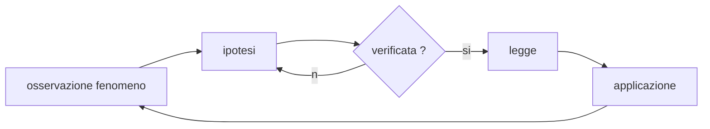

# Le Misure  

La fisica si occupa dello studio dei **fenomeni** che accadono in natura, attraverso quelle che che vengono chiamate **grandezze fisiche**. I fenomeni fisici vengono analizzati attraverso il **metodo sperimentale**, introdotto per la prima volta da Galilei.    

Misurare significa associare un numero ad una grandezza ottenuto facendo un **confronto** tra la grandezza in esame ed una grandezza di riferimento, ovvero l'**unita' di misura**.  

Par fare in modo di poter scambiare informazioni sulle grandezze e' necessario scegliere, anche se in modo arbitrario un campione di riferimento, detto appunto unita' di misura. E' importante rendersi conto che senza unita' di misura il valore numerico di una grandezza e' privo di significato. 