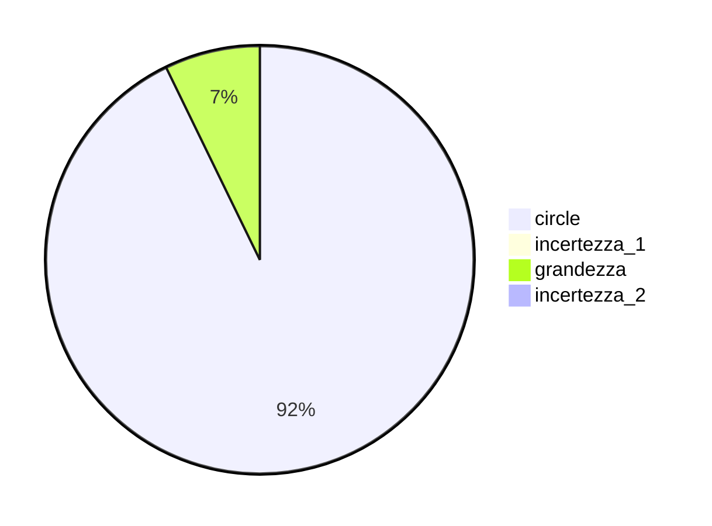

  
  

## Esercizio 4  

Il primo valore numerico e' 1 formato da 5 divisioni per cui la piu' piccola variazione rilevabile e' $\dfrac{1}{5} = 0.2\ cm$  

## Esercizio 5  

Nel primo caso $A$ si ha $\dfrac{10}{5} = 2\ cm$, mentre in $B$ si ha $\dfrac{20}{4} = 5\ cm$, infine in $C$ si ha $\dfrac{5}{10} = 0.5\ cm$.  

 

## Esercizio 6  

La piu' piccola variazione rilevabile sembra essere $0.01\ s$ ovvero un centesimo di secondo.  

## Esercizio 7  

Se l'incertezza e' $\pm 2\ mm$ allora si ha un intervallo di $4\ mm$.  

## Esercizio 10  

L'errore di sensibilita' e' di $1^\circ C$, il valore della grandezza di $26^\circ C$ quindi si ha una misura $t = 26\pm 1^\circ C$  

## Esercizio 11  

Si ha una misura $\ell = 7.8\pm0.1\ cm$  

## Esercizio 12  

## Esercizio 13  

Se l'errore di sensibilita' e' di $20\ g$ allora l'intervallo sara' individuato da $340\pm 20\ g$ ovvero $320 \le x \ge 360$  

## Esercizio 14  

Si ha che $0.5\ mm = 0.05\ cm$ allora l'intervallo sara' $2.15 \le x \ge 2.25$  

## Esercizio 15  

La misura piu' precisa sara' quella con l'errore relativo minore ovvero A con $0.0045$  

## Esercizio 16  

La misura meno precisa sara' quella con l'errore relativo maggiore ovvero A con $0.0125$  

## Esercizio 17  

Si ha che $\varepsilon_r(t) = \dfrac{0.01}{0.95} = 0.01053$ mentre $\varepsilon_r(\ell) = \dfrac{0.01}{23.5} = 0.00043$  

## Esercizio 18  

$\varepsilon_r(v) = \dfrac{4}{112} = 0.03571$  

$\varepsilon_r(a) = \dfrac{0.01}{9.81} = 0.00102$  

$\varepsilon_r(t) = \dfrac{0.01}{0.95} = 0.00543$  

## Esercizio 19  

La piu' precisa tra le misure sara' quella' con l'errore relativo minore, quindi in ordine di precisione:  

$\varepsilon_r(C) = \dfrac{1}{40} = 0.025$  

$\varepsilon_r(B) = \dfrac{2}{50} = 0.04$  

$\varepsilon_r(A) = \dfrac{5}{100} = 0.05$  

$\varepsilon_r(D) = \dfrac{0.5}{0.8} = 0.625$  

## Esercizio 20  

La meno precisa tra le misure sara' quella con l'errore relativo maggiore, quindi in ordine di imprecisione:  

$\varepsilon_r(B) = \dfrac{0.05}{0.85} = 0.0588$  

$\varepsilon_r(C) = \dfrac{0.5}{39} = 0.0128$  

$\varepsilon_r(A) = \dfrac{0.1}{15.4} = 0.0065$  

$\varepsilon_r(D) = \dfrac{2}{460} = 0.0043$  

## Esercizio 21  

Sapendo che $\varepsilon_r = \dfrac{\Delta x}{x_m}$ allora...  

$250 \cdot 0.02 = \dfrac{\Delta x}{\cancel{250}} \cdot \cancel{250} = 5\ cm$  

## Esercizio 22  

Sapendo che $\varepsilon_r = \dfrac{\Delta x}{80} = 0.00625$ allora... $80 \cdot 0.00625 = \dfrac{\Delta x}{\cancel{80}} \cdot \cancel{80} = 0.5\ kg$  
La misura della massa e' allora $m = 80\pm 0.5\ kg$  

## Esercizio 23  

Sapendo che $\varepsilon_r = \dfrac{2}{x_m} = 0.0125$ allora...  

$\dfrac{1}{0.0125} \cdot \cancel{x_m} \cdot \dfrac{2}{\cancel{x_m}} = \cancel{0.0125} \cdot x_m \cdot \dfrac{1}{\cancel{0.0125}}$  

... in definitiva $x_m = \dfrac{2}{0.0125} = 160\ s$  

## Esercizio 24  

Si hanno 5 divisioni per volt, ovvero una sensibilita' di $\dfrac{1}{5} = 0.2\ V$ allora...  

$\varepsilon_r(A) = \dfrac{0.2}{1.8} = 0.11111$  

$\varepsilon_r(B) = \dfrac{0.2}{3.4} = 0.05882$  

## Esercizio 25  

Si hanno 10 divisioni per ampere, ovvero una sensibilita' di $\dfrac{1}{10} = 0.1\ A$ allora...  

$\varepsilon_r(A) = \dfrac{0.1}{0.9} = 0.11111$  

$\varepsilon_r(B) = \dfrac{0.1}{2.4} = 0.04167$  

## Esercizio 26  

Si hanno 10 divisioni per 4 newton, ovvero una sensibilita' di $\dfrac{4}{10} = 0.4\ N$ allora...  

$\varepsilon_r = \dfrac{0.4}{4.8} = 0.08333$  

## Esercizio 27-28  

| Tabella A       |         |         |          |
| --------------- | ------- | ------- | -------- |
| $\Delta x$      | 1       | 0.5     | 0.1      |
| $x_m$           | 14      | 14      | 14       |
| $\varepsilon_r$ | 0.07142 | 0.03571 | 0.007142 |

Restando costante il valore della grandezza se diminuisce l'incertezza allora anche l'errore relativo diminuisce, ottenendo cosi' una misura piu' precisa.  

| Tabella B       |         |         |        |
| --------------- | ------- | ------- | ------ |
| $\Delta x$      | 0.1     | 0.1     | 0.1    |
| $x_m$           | 18.6    | 25.9    | 71     |
| $\varepsilon_r$ | 0.00537 | 0.00386 | 0.0014 |

Restando costante l'incertezza se aumenta il valore della grandezza allora l'errore relativo diminuisce, ottenendo anche in questo caso una misura piu' precisa.  

## Esercizio 29  

|              |               |                 |                     |
| ------------ | ------------- | --------------- | ------------------- |
| strumento    | bilancia      | metro           | termometro          |
| grandezza    | massa         | lunghezza       | temperatura         |
| errore sens. | $2\ g$        | $0.1\ cm$       | $1^\circ C$         |
| valore       | $160\ g$      | $12\ cm$        | $36.2^\circ C$      |
| misura       | $160\pm 2\ g$ | $12\pm 0.1\ cm$ | $36.2\pm 1^\circ C$ |
| errore rel.  | $0.0125$      | $0.0083$        | $0.0276$            |

## Esercizio 30  

Dati i rispettivi errori di sensibilita' $\varepsilon_{s}(t) = \dfrac{10}{10} = 1$ e $\varepsilon_{s}(s) = \dfrac{2}{10} = 0.2$ si ottengono le misure:  

$t_P = 17\pm 1\ s$  
$s_P = 5.8\pm 0.2\ m$

L'errore di sensibilita' della carta millimetrata fa si che gli intervalli di indeterminazione individuino l'area del rettangolo che contiene il punto P.  