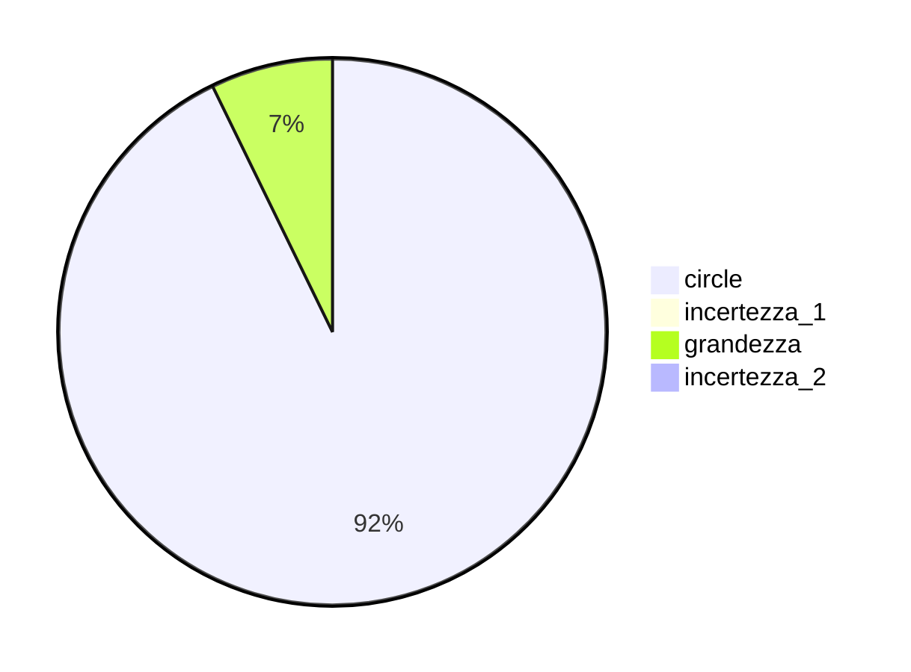

  
  

## Esercizio 4  

Il primo valore numerico e' 1 formato da 5 divisioni per cui la piu' piccola variazione rilevabile e' $\dfrac{1}{5} = 0.2\ cm$  

## Esercizio 5  

Nel primo caso $A$ si ha $\dfrac{10}{5} = 2\ cm$, mentre in $B$ si ha $\dfrac{20}{4} = 5\ cm$, infine in $C$ si ha $\dfrac{5}{10} = 0.5\ cm$.  

 

## Esercizio 6  

La piu' piccola variazione rilevabile sembra essere $0.01\ s$ ovvero un centesimo di secondo.  

## Esercizio 7  

Se l'incertezza e' $\pm 2\ mm$ allora si ha un intervallo di $4\ mm$.  

## Esercizio 10  

L'errore di sensibilita' e' di $1^\circ C$, il valore della grandezza di $26^\circ C$ quindi si ha una misura $t = 26\pm 1^\circ C$  

## Esercizio 11  

Si ha una misura $\ell = 7.8\pm0.1\ cm$  

## Esercizio 12  

## Esercizio 13  

Se l'errore di sensibilita' e' di $20\ g$ allora l'intervallo sara' individuato da $340\pm 20\ g$ ovvero $320 \le x \ge 360$  

## Esercizio 14  

Si ha che $0.5\ mm = 0.05\ cm$ allora l'intervallo sara' $2.15 \le x \ge 2.25$  

## Esercizio 15  

La misura piu' precisa sara' quella con l'errore relativo minore ovvero A con $0.0045$  

## Esercizio 16  

La misura meno precisa sara' quella con l'errore relativo maggiore ovvero A con $0.0125$  

## Esercizio 17  

